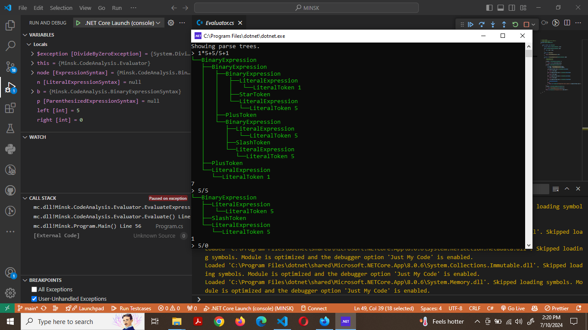

# Minsk Compiler

A lightweight, educational compiler written in C# that demonstrates fundamental compiler concepts through a simple expression language. This project provides a complete end-to-end implementation of lexical analysis, parsing, and evaluation of arithmetic expressions.



## Features

- **Lexical Analysis**: Tokenization of source text into meaningful tokens
- **Parsing**: Construction of a syntax tree from tokens
- **Syntax Tree Generation**: Building an abstract syntax tree (AST) representation
- **Expression Evaluation**: Computing the results of parsed expressions
- **Parse Tree Visualization**: Interactive visualization of the syntax tree
- **Error Reporting**: Basic diagnostics for syntax errors

## Supported Expressions

The compiler currently supports basic arithmetic expressions involving:

- Addition (`+`)
- Subtraction (`-`)
- Multiplication (`*`)
- Division (`/`)
- Parentheses for grouping (`()`)

## Getting Started

### Prerequisites

- [.NET SDK 8.0](https://dotnet.microsoft.com/download) or later
- Visual Studio 2022, Visual Studio Code, or any C# IDE

### Building the Project

```powershell
# Clone the repository
git clone https://github.com/yourusername/MINSK.git
cd MINSK

# Build the project
dotnet build
```

### Running the Compiler

```powershell
cd mc
dotnet run
```

## Usage

### Interactive Mode

The compiler runs in an interactive REPL (Read-Eval-Print Loop) mode. After running the program, you can type in arithmetic expressions to be evaluated:

```
> 1 + 2 * 3
7
```

### Commands

- `#showTree`: Toggle the display of the parse tree
- `#cls`: Clear the console

### Example Session

```
> 1 + 2 * 3
7

> #showTree
Showing parse tree.

> 1 + 2 * 3
└── BinaryExpression
    ├── NumberToken 1
    ├── PlusToken +
    └── BinaryExpression
        ├── NumberToken 2
        ├── StarToken *
        └── NumberToken 3
7
```

## Project Structure

- **Program.cs**: Main entry point and REPL implementation
- **CodeAnalysis/**: Contains the compiler components
  - **Lexer.cs**: Converts source text into tokens
  - **Parser.cs**: Builds the syntax tree from tokens
  - **SyntaxTree.cs**: Represents the parsed syntax tree
  - **Evaluator.cs**: Computes the result of expressions
  - **SyntaxNode.cs**: Base class for all nodes in the syntax tree
  - **SyntaxToken.cs**: Represents tokens in the source code
  - **SyntaxKind.cs**: Enum defining all token and node types

## Code Overview

### Main Program

The `Main` method in `Program.cs` handles reading user input, toggling the display of the parse tree, and evaluating expressions.

### Lexer

The `Lexer` class is responsible for breaking the input text into a sequence of tokens.

### Parser

The `Parser` class processes the tokens produced by the lexer and constructs a syntax tree.

### Syntax Tree

The syntax tree is represented by various classes inheriting from `SyntaxNode`, including:
- `SyntaxToken`
- `ExpressionSyntax`
- `NumberExpressionSyntax`
- `BinaryExpressionSyntax`
- `ParenthesizedExpressionSyntax`

### Evaluator

The `Evaluator` class walks the syntax tree and computes the value of the expression.

## Future Improvements

- Support for variables and assignment
- Conditional expressions and boolean logic
- User-defined functions
- Control flow statements (if, while, for)
- Static type checking
- Code generation to IL or another target language
- Optimization passes

## Contributing

Contributions are welcome! Please feel free to submit a Pull Request.

1. Fork the repository
2. Create your feature branch (`git checkout -b feature/amazing-feature`)
3. Commit your changes (`git commit -m 'Add some amazing feature'`)
4. Push to the branch (`git push origin feature/amazing-feature`)
5. Open a Pull Request

## License

This project is licensed under the MIT License - see the [LICENSE](LICENSE) file for details.

## Acknowledgments

- Inspired by the Minsk compiler series by [@terrajobst](https://github.com/terrajobst)
- Built with C# and .NET